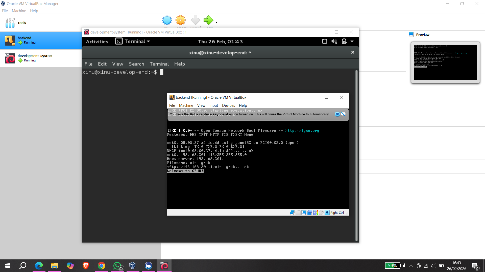

# <h1 align="center">Laporan Praktikum Modul 1   Running Modul</h1>

Hafizh Dwi Andhika Faruq - 2311104013

## Dasar Teori

Virtual Box merupakan perangkat lunak virtualisasi yang memungkinkan komputer untuk menjalankan beberapa sistem operasi secara bersamaan dalam bentuk mesin virtual (virtual machine).

## Guided

## Referensi

1. https://en.wikipedia.org/wiki/VirtualBox
