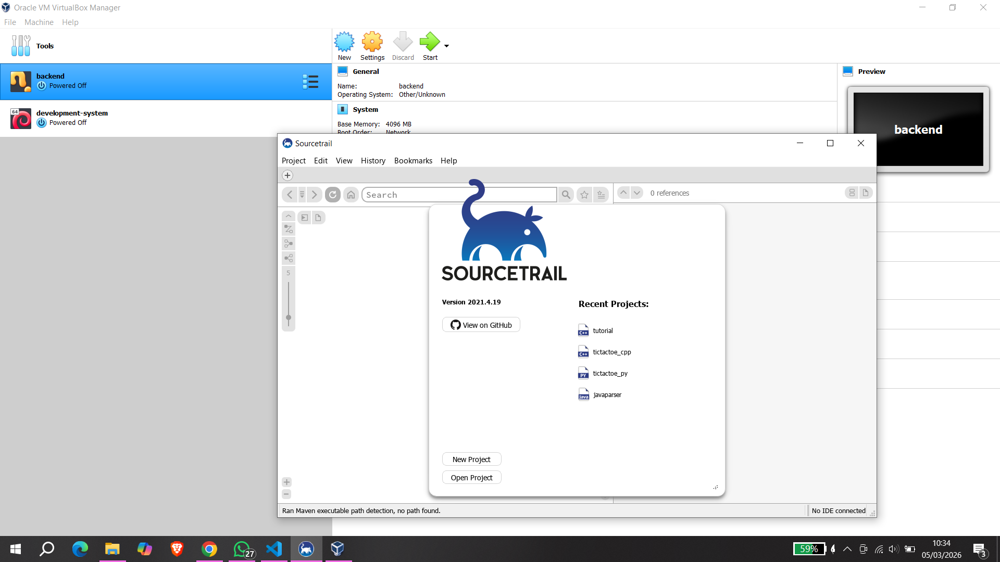

# <h1 align="center">Laporan Praktikum Modul 1   Running Modul</h1>

Hafizh Dwi Andhika Faruq - 2311104013

## Dasar Teori

VirtualBox adalah perangkat lunak virtualisasi yang dikembangkan oleh Oracle Corporation yang memungkinkan pengguna menjalankan beberapa sistem operasi secara bersamaan pada satu komputer. Dengan menggunakan teknologi virtual machine, VirtualBox dapat membuat komputer virtual sehingga sistem operasi lain seperti Linux atau Windows dapat dijalankan di dalam sistem operasi utama tanpa perlu mengubah konfigurasi komputer utama.

Sourcetrail adalah alat analisis dan visualisasi kode sumber yang digunakan untuk memahami struktur dan hubungan dalam sebuah proyek perangkat lunak. Aplikasi ini membantu pengembang menelusuri fungsi, kelas, variabel, dan dependency kode secara visual sehingga lebih mudah memahami alur program dan hubungan antar komponen dalam kode yang kompleks.

## Guided

## Referensi

1. https://en.wikipedia.org/wiki/VirtualBox
2. https://en.wikipedia.org/wiki/Sourcetrail
