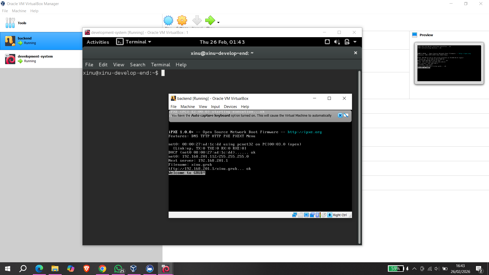

# <h1 align="center">Laporan Praktikum Modul 1   Running Modul</h1>

Hafizh Dwi Andhika Faruq - 2311104013

## Dasar Teori

Xinu adalah sistem operasi eksperimental yang dibuat untuk tujuan pendidikan dan penelitian. Xinu dirancang sederhana agar memudahkan pembelajaran konsep dasar sistem operasi seperti manajemen proses, memori, dan penjadwalan CPU.

## Guided

## Referensi

1. https://en.wikipedia.org/wiki/Xinu
