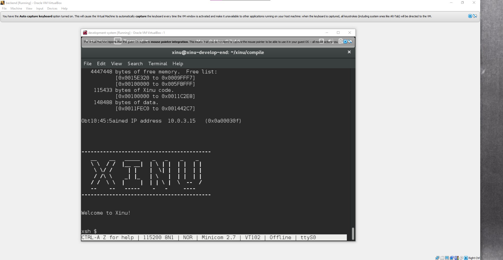
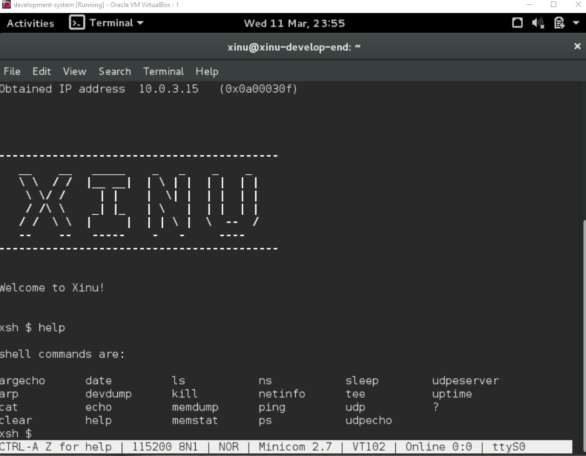
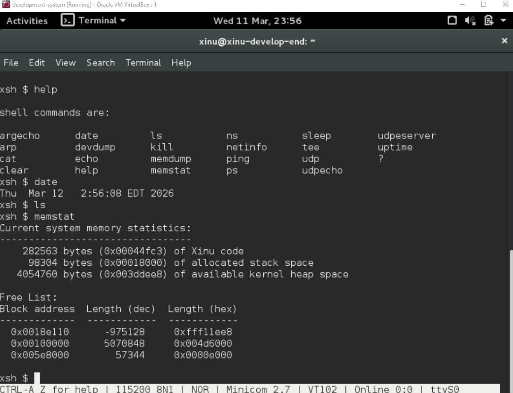

# <h1 align="center">Laporan Praktikum Modul 3   Eksplorasi Xinu</h1>

Hafizh Dwi Andhika Faruq - 2311104013

## Dasar Teori

Xinu adalah sistem operasi eksperimental yang dibuat untuk tujuan pendidikan dan penelitian. Xinu dirancang sederhana agar memudahkan pembelajaran konsep dasar sistem operasi seperti manajemen proses, memori, dan penjadwalan CPU. Sistem operasi ini dikembangkan oleh Douglas Comer dan sering digunakan dalam praktikum sistem operasi di berbagai universitas.

Selain itu, Xinu memiliki struktur kode yang sederhana sehingga mudah dipelajari dan dimodifikasi. Melalui berbagai perintah shell, pengguna dapat melakukan eksperimen untuk memahami cara kerja proses, memori, perangkat, dan jaringan dalam sistem operasi.
.

## Guided

1. Jalankan Xinu OS, kemudian eksekusi perintah-perintah yang tersedia pada Shell Xinu. Selanjutnya, uraikan serta jelaskan fungsi dari setiap perintah yang terdapat di dalam Xinu! Perintah “help” => untuk menampilkan semua perintah pada Xinu

> Terdapat beberapa perintah yang ada pada Shell Xinu yaitu:

- argecho = menampilkan kembali argumen yang dimasukan ke perintah
- arp = menampilkan atau mengelola tabel ARP (Address Resolution Protocol) yang memetakan address ke MAC Address
- cat = menampilkan isi file di layar
- clear = membersihkan tampilan layar terminal
- date = menampilkan tanggal dan waktu sistem
- devdump = menampilkan informasi detail tentang perangkat yang terdaftar di sistem
- echo = menampilkan isi teks di layar
- help = menampilkan daftar perintah yang tersedia di xinu
- ls = menampilkan daftar file atau direktori
- kill = menghentikan proses yang sedang berjalan berdasarkan id proses (PID)
- memdump = menampilkan isi memori pada alamat tertentu
- memstat = menampilkan status penggunaan memori sistem
- ns = melakukan pencarian alamat menggunakan name server (DNS)
- netinfo = menampilkan informasi konfigurasi jaringan sistem
- ping = menguji koneksi jaringan
- ps = menampilkan daftar proses yang sedang berjalan
- sleep = menunda eksekusi proses selama beberapa waktu
- tee = menampilkan output ke layar sekaligus menyimpan ke file
- udp = mengirim atau menerima paket menggunakan protokol UDP
- udpecho = mengirim paket UDP dan menerima kembali respon
- udpserver = menjalankan server sederhana yang menerima paket UDP
- uptime = menampilkan lama waktu sistem telah berlajan sejak dinyalakan
- ? = perintah alternatif untuk menampilkan bantuan (sama seperti help)

    
    
    

2. Jawablah pertanyaan-pertanyaan berikut ini:
   - Berapa jumlah perintah pada Xinu?  
     Terdapat 23 jumlah perintah pada Xinu
   - Sebutkan 2 perintah yang mempunyai fungsi yang sama!  
     memstat dan memdump, yaitu 2 perintah yang digunakan untuk melihat informasi memori
   - Berapa IP address Xinu?  
     192.168.1.2
   - Perintah apa yang digunakan untuk mengetahui IP address?  
     ipaddr
   - Berapa IP DNS server yang digunakan oleh Xinu?  
     8.8.8.8
   - Terdapat berapa proses yang sedang berjalan pada Xinu?  
     Terdapat 8 proses yang berjalan
   - Proses apa yang mempunyai prioritas paling rendah?  
     Null process
   - Proses apa yang mempunyai ukuran paling besar?  
     Main process
   - Proses apa yang berada dalam state current?  
     Main process
   - Proses apa yang berada dalam state suspend?  
     Shell process
   - Berapa PID (Process ID) dari Main process?  
     PID dari Main Process adalah 1

## Referensi

1. https://en.wikipedia.org/wiki/Xinu
