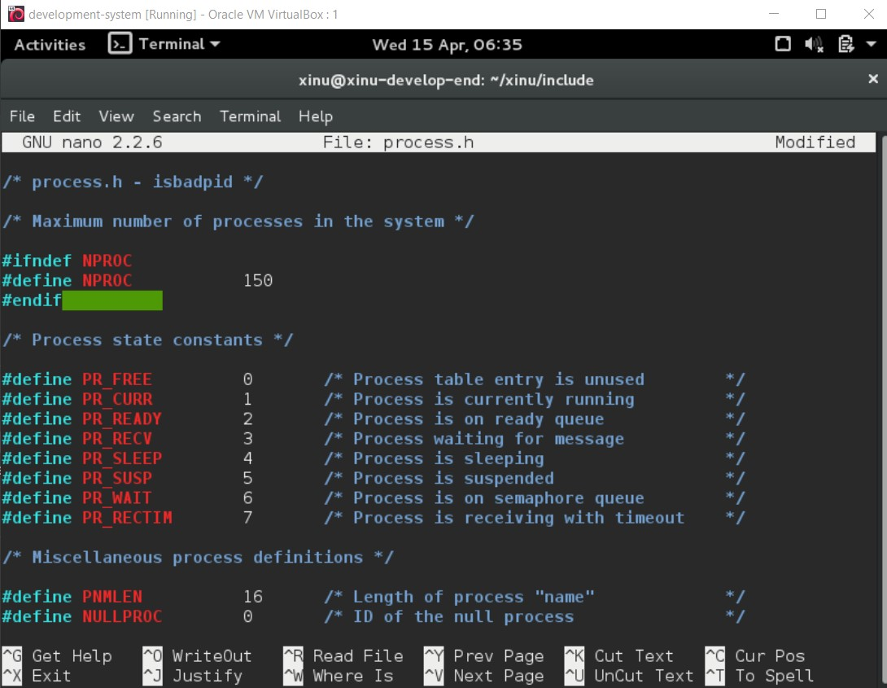
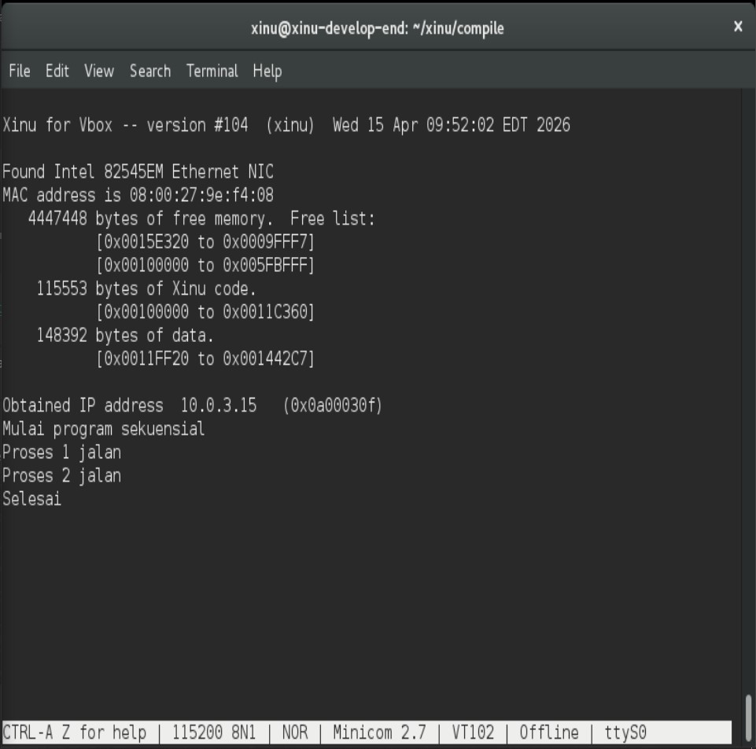
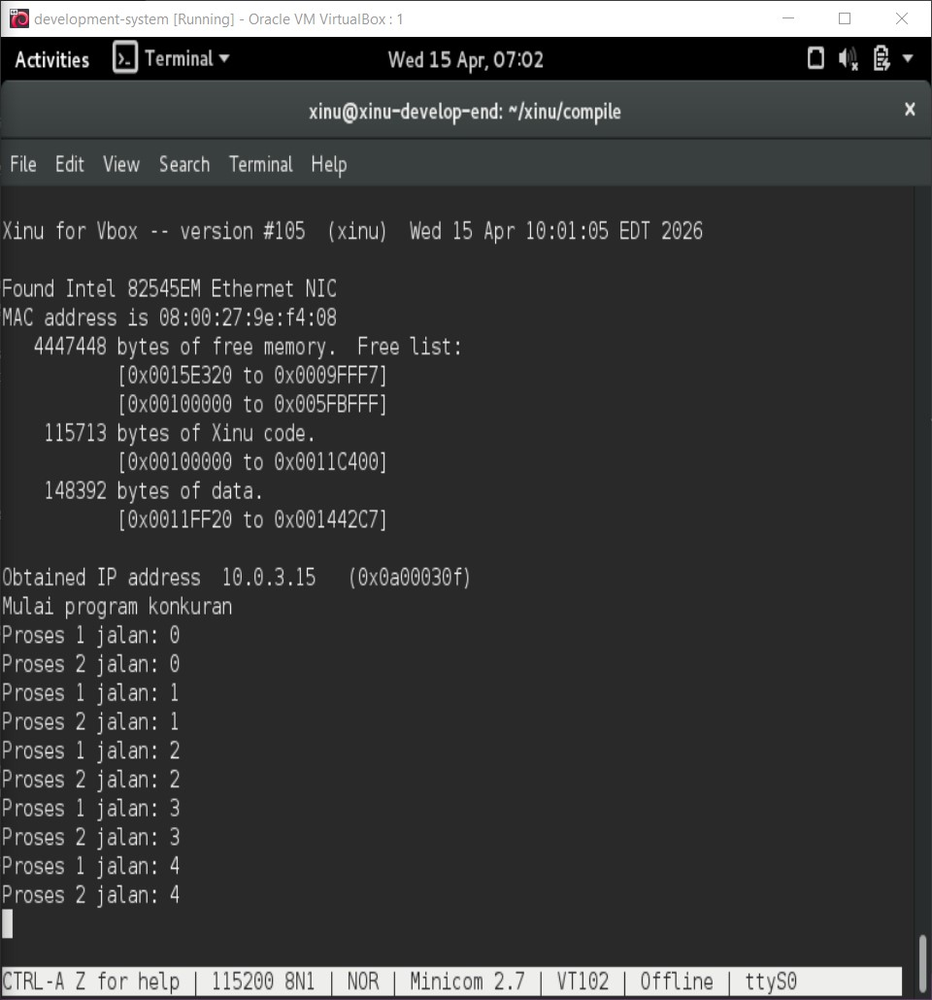
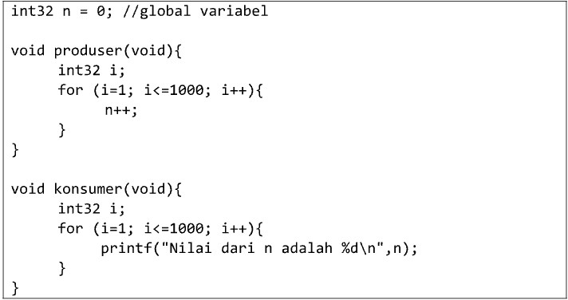
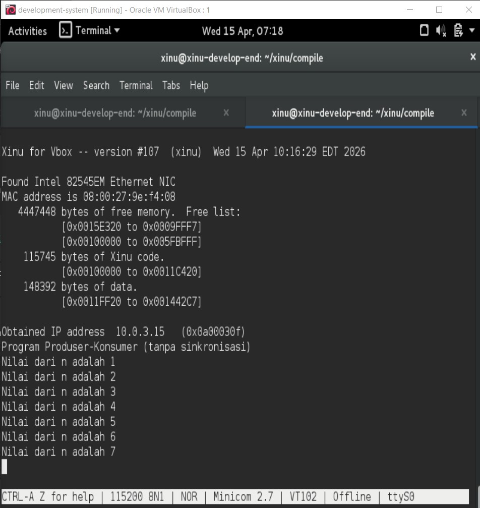

# <h1 align="center">Laporan Praktikum Modul 6   Sekuensial dan Konkuren</h1>

Hafizh Dwi Andhika Faruq - 2311104013

## Dasar Teori

Xinu adalah sistem operasi eksperimental yang dibuat untuk tujuan pendidikan dan penelitian. Xinu dirancang sederhana agar memudahkan pembelajaran konsep dasar sistem operasi seperti manajemen proses, memori, dan penjadwalan CPU. Sistem operasi ini dikembangkan oleh Douglas Comer dan sering digunakan dalam praktikum sistem operasi di berbagai universitas.

Selain itu, Xinu memiliki struktur kode yang sederhana sehingga mudah dipelajari dan dimodifikasi. Melalui berbagai perintah shell, pengguna dapat melakukan eksperimen untuk memahami cara kerja proses, memori, perangkat, dan jaringan dalam sistem operasi.
.

## Guided

1. Selain hardware (memory), batasan maksimal proses dapat ditentukan dengan secara software. Pada Linux maksimal proses adalah
   4194303 proses (64 bit) dan 32767 proses (32 bit) dapat dilihat melalui perintah $cat /proc/sys/kernel/pid_max

   Carilah pada source code Xinu yang memberi batasan mengenai banyaknya proses yang bisa
   dibuat! Berapa maksimal proses dalam Xinu? Ubah menjadi maksimal 150 proses!

   Maksimal proses default pada Xinu adalah 50, bisa diubah di include/process.h  
   

2. Jalankan kode sekuensial!  
   
3. Jalankan kode konkuren!  
   
4. Buatlah 2 proses produser dan konsumer. Produser memproduksi angka integer dari 1-1000. Konsumer mengkonsumsi integer yang
   diproduksi oleh produser dan menampilkannya!(Gunakan variabel global bertipe int32 bernama n yang digunakan secara bersama oleh kedua proses)  
     
   Hasil dari program ini cukup mengejutkan (tidak akan sesuai dengan intuisi awal). Jelaskan
   mengapa hasilnya seperti itu!  
   

## Referensi

1. https://en.wikipedia.org/wiki/Xinu
