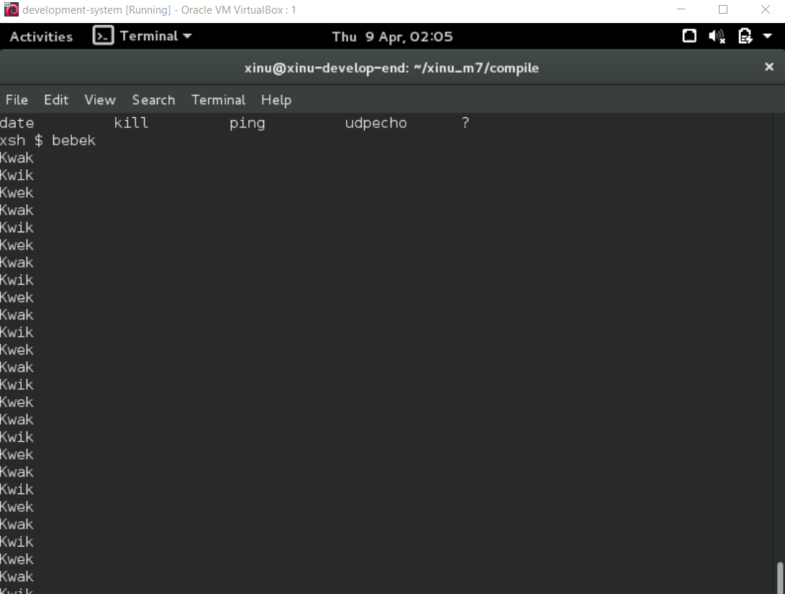
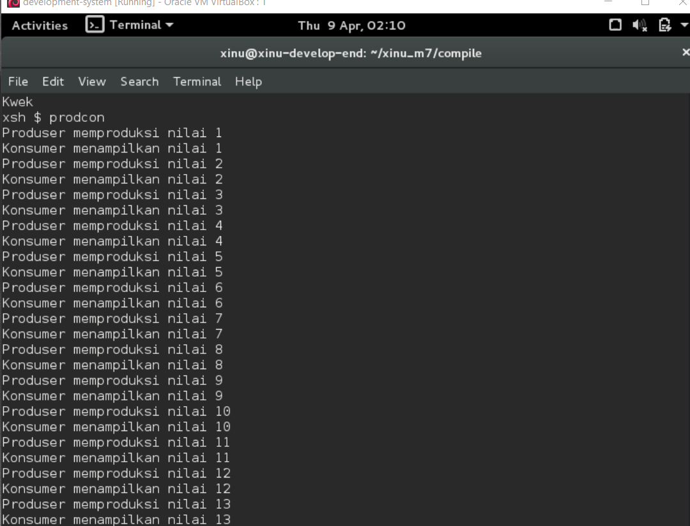

# <h1 align="center">Laporan Praktikum Modul 6   Semaphore </h1>

Hafizh Dwi Andhika Faruq - 2311104013

## Dasar Teori

Xinu adalah sistem operasi eksperimental yang dibuat untuk tujuan pendidikan dan penelitian. Xinu dirancang sederhana agar memudahkan pembelajaran konsep dasar sistem operasi seperti manajemen proses, memori, dan penjadwalan CPU.

## Guided

1. [50 poin] Buatlah 3 buah proses yaitu P1, P2 dan P3. P1 selalu menampilkan “kwak”,
   P2 selalu menampilkan “kwik”, P3 selalu menampilkan “kwek”. Menggunakan 3
   proses tersebut dan beberapa buah semaphore, buatlah program yang dapat
   menampilkan:
   Kwak
   Kwik
   Kwek
   Kwak
   Kwik
   Kwek
   
2. [50 poin] Buatlah proses bernama produser yang memproduksi bilangan 1-1000.
   Buatlah proses bernama konsumer yang akan menampilkan nilai yang diproduksi
   oleh produser. Gunakan semaphore!
   Produser memproduksi nilai 1
   Konsumer menampilkan nilai 1
   Produser memproduksi nilai 2
   Konsumer menampilkan nilai 2
   ….
   Produser memproduksi nilai 1000
   Konsumer menampilkan nilai 1000
   

## Referensi

1. https://en.wikipedia.org/wiki/Xinu
