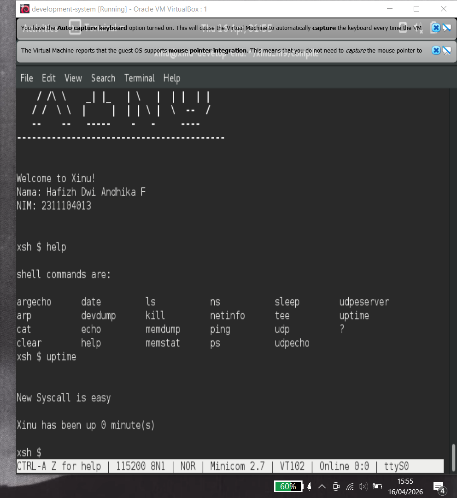
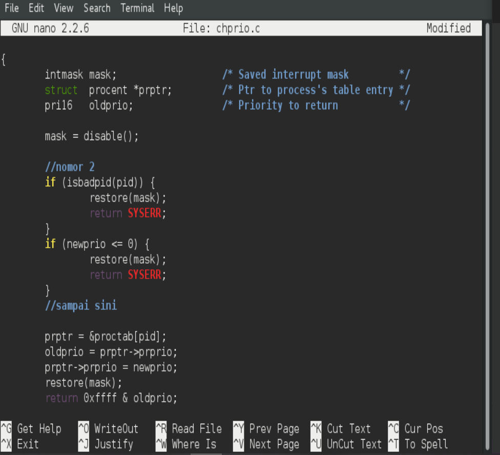
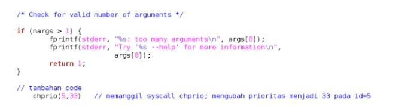
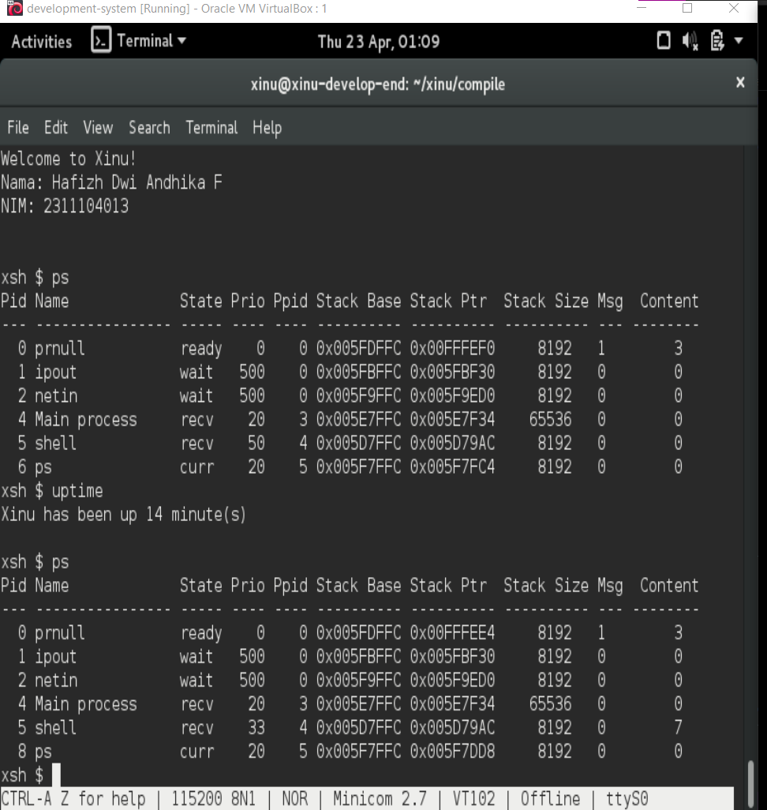

# <h1 align="center">Laporan Praktikum Modul 9   Syscall </h1>

Hafizh Dwi Andhika Faruq - 2311104013

## Dasar Teori

Xinu adalah sistem operasi eksperimental yang dibuat untuk tujuan pendidikan dan penelitian. Xinu dirancang sederhana agar memudahkan pembelajaran konsep dasar sistem operasi seperti manajemen proses, memori, dan penjadwalan CPU.

## Guided

1. [50 Poin] Buat syscall baru seperti yang ditunjukkan pada modul syscall poin 9.5!
   (sertakan Screenshot kode dan hasil run)
     
2. [25 Poin] Perbaiki syscall chprio (xinu/system/chprio.c) dengan memperhatikan validasi
   input  
   ● Pastikan id adalah angka dari 0 – NPROC (ukuran maks banyaknya proses) 
   ● Pastikan prioritas adalah bilangan yang positif 
   Compile dan jalankan Xinu dengan syscall yang telah diperbaiki 
   ● make clean  
   ● make  
     
3. Lakukan hal-hal berikut ini  
   ● Edit xsh_uptime.c  
   Tambahkan kode berikut  
     
   ● Compile source code tersebut dengan perintah  
   ● make clean  
   ● make  
   ● Jalankan perintah ps  
   ● xsh $ps  
   ● perhatikan prioritas proses dengan id = 5  
   ● Jalankan uptime  
   ● xsh $uptime  
   ● Perhatikan hasil perintah tersebut  
   ● Jalankan ps  
   ● xsh $ps  
   ● perhatikan prioritas proses dengan id = 5 seharusnya sudah berubah  

   [25 Poin] Testing chprio syscall yang telah diubah  
   ● Testing prioritas tidak boleh &lt; 0: Ubah “chprio(5,33)” menjadi “chprio(5,-3)”  
   pada xsh_uptime.c  
   ● Testing id adalah valid: Ubah “chprio(5,33)” menjadi “chprio(3000,3)”  
   ● Hasil dua testing di atas adalah prioritas tidak berubah karena salah argument  
   (dibuktikan dengan menggunakan perintah ps)  
     

## Referensi

1. https://en.wikipedia.org/wiki/Xinu
