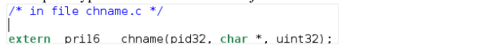
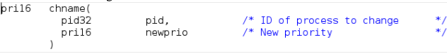
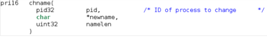
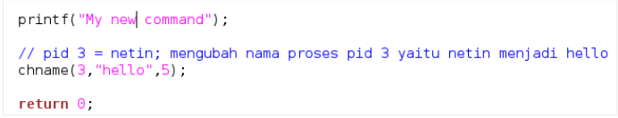
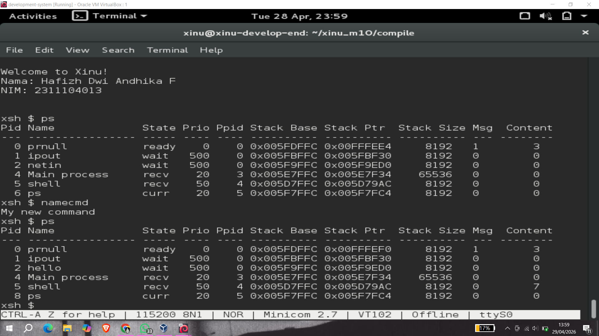

# <h1 align="center">Laporan Praktikum Modul 10   Shell </h1>

Hafizh Dwi Andhika Faruq - 2311104013

## Dasar Teori

Xinu adalah sistem operasi eksperimental yang dibuat untuk tujuan pendidikan dan penelitian. Xinu dirancang sederhana agar memudahkan pembelajaran konsep dasar sistem operasi seperti manajemen proses, memori, dan penjadwalan CPU.

## Guided

1. [40 Poin] Akan dimodifikasi shell dengan modifikasi syscall bernama chname yang
   berfungsi untuk mengubah nama suatu proses. Lihat kembali modul sebelumnya cara
   membuat syscall.
   Perhatikan sekarang syscall chname mempunyai 3 parameter yaitu pid, character dan
   panjang character. Character untuk menyimpan nama dan panjang character untuk
   panjang nama.  
   a. Pada prototypes.h chname diubah menjadi:  
     
   b. Pada chname.c fungsi diubah dari:  
     
   Menjadi  
     
   Modifikasi kode pada chname.c sehingga nama proses bisa diubah bila syscall tersebut
   dipanggil.
2. [40 Poin] Buatlah perintah baru bernama namecmd sesuai dengan langkah-langkah pada
   no.5 pada modul shell!
   Berikut adalah kode dalam perintah baru namecmd:  
     
3. [20 Poin] Test hasilnya:  
   a. Masuk ke terminal xinu  
   b. Jalankan perintah ps  
   c. Jalankan perintah namecmd  
   d. Jalankan perintah ps  
   e. Lihat nama proses telah berubah  

   Jawaban:  
   Proses dengan PID 2 (netin) diubah menjadi hello  
     

## Referensi

1. https://en.wikipedia.org/wiki/Xinu
