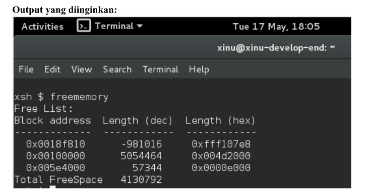
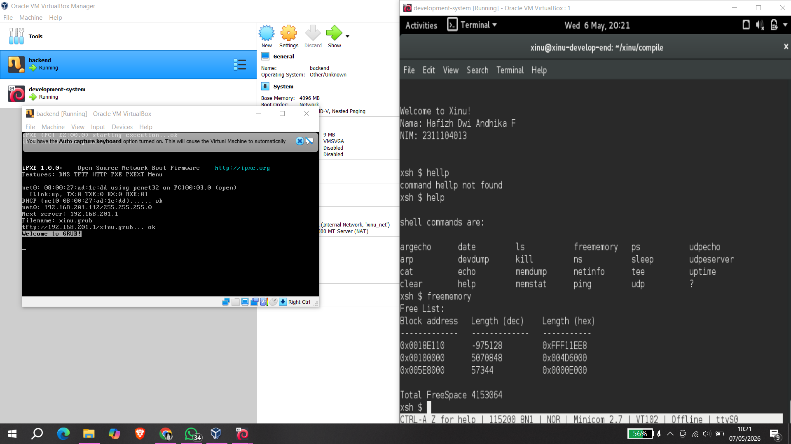

# <h1 align="center">Laporan Praktikum Modul 11   Memori Xinu </h1>

Hafizh Dwi Andhika Faruq - 2311104013

## Dasar Teori

Xinu adalah sistem operasi eksperimental yang dibuat untuk tujuan pendidikan dan penelitian. Xinu dirancang sederhana agar memudahkan pembelajaran konsep dasar sistem operasi seperti manajemen proses, memori, dan penjadwalan CPU.

## Guided

1. [80 poin] Buatlah perintah baru bernama freememory yang memiliki dua fungsi berikut:  
   a. [40 poin] Menampilkan seluruh free memory block yang tercatat dalam free memory
   list pada Xinu.  
   b. [40 poin] Menghitung dan menampilkan total ukuran free memory berdasarkan
   seluruh block yang ada pada list tersebut.  
     
   Jawab:  
     
2. [4 poin per subsoal] Jawablah pertanyaan berikut:  
   a. Mengapa Xinu memisahkan data segment dan BSS segment?  
   Jawab: Xinu memisahkan data segment dan BSS segment untuk efisiensi penggunaan memori. Data segment digunakan untuk menyimpan variabel global yang sudah memiliki nilai awal, sedangkan BSS segment digunakan untuk variabel global yang belum diinisialisasi.  
   b. Bagaimana alokasi dan dealokasi memori selama eksekusi memengaruhi ukuran free space?  
   Jawab: Saat proses meminta memori menggunakan heap atau stack, ukuran free space akan berkurang karena sebagian ruang digunakan untuk alokasi memori. Sebaliknya, ketika memori dilepaskan melalui proses dealokasi, ukuran free space akan bertambah karena blok memori dikembalikan ke daftar free memory.  
   c. Mengapa penggunaan heap lebih berpotensi menimbulkan masalah dibandingkan stack?  
   Jawab: Heap lebih berpotensi menimbulkan masalah karena alokasi dan dealokasi dilakukan secara bebas selama program berjalan. Hal ini dapat menyebabkan fragmentasi memori, yaitu free space terpecah menjadi blok-blok kecil sehingga sulit digunakan kembali.  
   d. Mengapa Xinu menggunakan struktur linked list untuk menyimpan free block?  
   Jawab: Xinu menggunakan linked list karena struktur ini fleksibel untuk mengelola free block yang ukurannya berubah-ubah secara dinamis. Linked list memudahkan sistem untuk menambah, menghapus, dan menggabungkan blok memori kosong tanpa harus memindahkan data lain ke memori.  
   e. Apa tantangan utama dalam penggunaan heap di Xinu?  
   Jawab: Tantangan utama penggunaan heap di Xinu adalah fragmentasi memori. Fragmentasi terjadi ketika proses alokasi dan dealokasi dilakukan berulang kali sehingga free space terpecah menjadi banyak blok kecil  

## Referensi

1. https://en.wikipedia.org/wiki/Xinu
