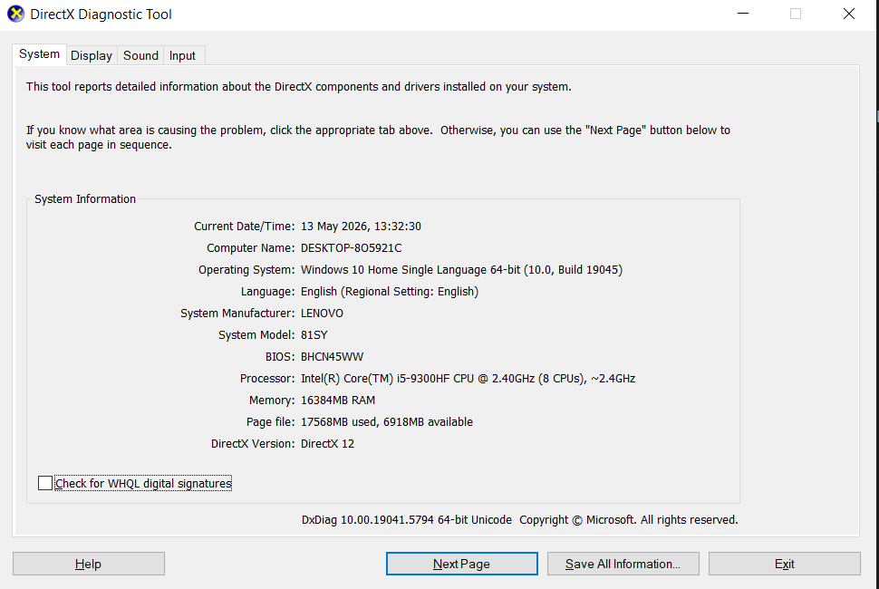
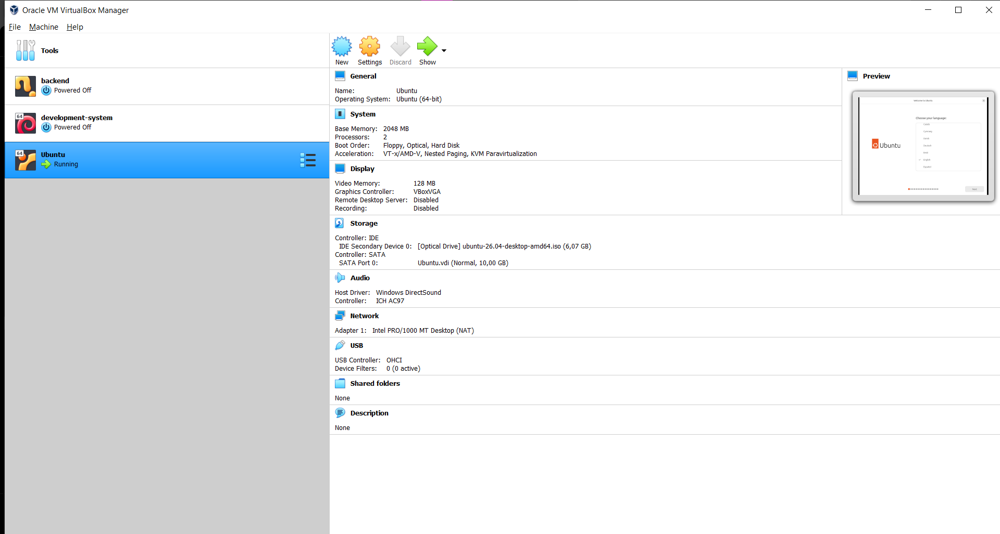

# <h1 align="center">Laporan Praktikum Modul 12   Linux dan Windows </h1>

Hafizh Dwi Andhika Faruq - 2311104013

## Dasar Teori

Windows dan Linux merupakan sistem operasi yang berfungsi mengatur perangkat keras dan perangkat lunak pada komputer agar dapat digunakan oleh pengguna. Windows dikembangkan oleh Microsoft dengan antarmuka yang mudah digunakan dan kompatibel dengan banyak aplikasi umum. Sementara itu, Linux adalah sistem operasi open-source yang dikembangkan dari kernel Linux dan memiliki berbagai distro seperti Ubuntu, Debian, dan Fedora, dengan keunggulan pada stabilitas, keamanan, serta fleksibilitas penggunaannya.

## Guided

1. [10 Poin] Jelaskan dengan bahasa sendiri, apa itu Sistem Operasi?  
   Jawab: Sistem operasi merupakan sebuah perangkat lunak yang mengatur seluruh kerja komputer. Sistem operasi berfungsi sebagai penghubung antara pengguna dengan perangkat keras komputer.
2. [25 Poin] Buka dxdiag pada kolom search windows, dan jawab pertanyaan berikut!  
   [5 Poin] Sertakan Screenshot!  
     
   a. [5 Poin] Windows apakah yang diinstal?  
   Jawab: Windows 10  
   b. [5 Poin] Berapa bit Windows yang diinstall?  
   Jawab: 64 bit  
   c. [5 Poin] Berapa kecepatan processor yang digunakan?  
   Jawab: 2.40GHz  
   d. [5 Poin] Grafik yang digunakan versi berapa? Apakah sudah sesuai dengan
   spesifikasi rekomendasi pada modul?  
   Jawab: Versi grafik yang diguankan adalah DirectX 12, sudah karena sudah menggunakan versi yang terbaru  
3. [10 Poin] Apa kelebihan dari windows yang terpasang sekarang? Sebutkan versi
   berapa windows terbaru saat ini!  
   Jawab: Kelebihan Windows 10 adalah memiliki tampilan yang mudah untuk digunakan dan kompatibel dengan banyak aplikasi maupun perangkat keras. Windows 10 juga ringan, dan stabil jika dibandingkan dengan beberapa versi sebelumnya, sehingga cocok untuk digunakan untuk bekerja, belajar, maupun untuk bermain game  
4. [25 Poin] Buka virtualbox, dan jawab pertanyaan berikut!  
   [5 Poin] Sertakan Screenshot!  
     
   a. [5 Poin] Linux apakah yang diinstall?  
   Jawab: Ubuntu 26.04  
   b. [5 Poin] Berapa bit Linux yang diinstall?  
   Jawab: 64 bit  
   c. [5 Poin] Berapa ukuran hard disk virtual mesin?  
   Jawab: 10,00 GB  
   d. [5 Poin] Terdapat berapa buah partisi pada hard disk?  
   Jawab: Terdapat dua partisi  
5. [10 Poin] Linux memiliki berbagai jenis, sebutkan 5 jenis linux distro!  
   Jawab:   1. Ubuntu   2. Debian   3. Fedora   4. Kali Linux   5. Linux Mint  
6. [10 Poin] Anda sudah mengenal dan menggunakan 3 jenis sistem operasi pada
   praktikum ini, sebutkan sistem operasi tersebut!  
   Jawab: Terdiri dari Windows, Linux (Ubuntu), dan Android  
7. [10 Poin] Setelah mengenal 3 jenis sistem operasi tersebut, menurut Anda sistem
   operasi mana yang lebih mudah digunakan? Jelaskan argumentasi Anda!  
   Jawab: Menurut saya yang paling mudah digunakan adalah Windows. Saya suka tampilan dari Windows 10 karena mudah untuk dipahami. Selain itu, hampir semua aplikasi bisa berjalan di Windows dan proses instalasi software juga mudah.  

## Referensi

1. https://id.wikipedia.org/wiki/Linux
2. https://en.wikipedia.org/wiki/Microsoft_Windows
3. https://en.wikipedia.org/wiki/Operating_system
